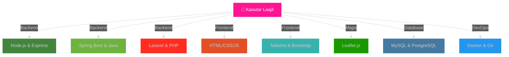

<!-- En-tête avec effet Matrix -->
<div align="center">

```
╔═══════════════════════════════════════════════════════════════════╗
║                                                                   ║
║   ██╗  ██╗ █████╗  ██████╗ ██╗   ██╗████████╗ █████╗ ██████╗    ║
║   ██║ ██╔╝██╔══██╗██╔═══██╗██║   ██║╚══██╔══╝██╔══██╗██╔══██╗   ║
║   █████╔╝ ███████║██║   ██║██║   ██║   ██║   ███████║██████╔╝   ║
║   ██╔═██╗ ██╔══██║██║   ██║██║   ██║   ██║   ██╔══██║██╔══██╗   ║
║   ██║  ██╗██║  ██║╚██████╔╝╚██████╔╝   ██║   ██║  ██║██║  ██║   ║
║   ╚═╝  ╚═╝╚═╝  ╚═╝ ╚═════╝  ╚═════╝    ╚═╝   ╚═╝  ╚═╝╚═╝  ╚═╝   ║
║                                                                   ║
╚═══════════════════════════════════════════════════════════════════╝
```


</div>

---

<div align="center">

## 🎨 『 STACK TECHNOLOGIQUE 』


</div>

### 🔥 Backend Universe

<div align="center">

```ascii
     ╔═══════════════════════════════════════════════════════════╗
     ║                    ⚡ BACKEND POWER ⚡                     ║
     ╠═══════════════════════════════════════════════════════════╣
     ║                                                           ║
     ║  🟢 Node.js        ━━━━━━━━━━━━━━━━━━━ ████████░ 90%    ║
     ║  🍃 Express.js     ━━━━━━━━━━━━━━━━━━━ ████████░ 85%    ║
     ║  ☕ Java           ━━━━━━━━━━━━━━━━━━━ ████████░ 88%    ║
     ║  🍀 Spring Boot    ━━━━━━━━━━━━━━━━━━━ ███████░░ 80%    ║
     ║  🎼 Laravel        ━━━━━━━━━━━━━━━━━━━ ███████░░ 82%    ║
     ║  🐘 MySQL          ━━━━━━━━━━━━━━━━━━━ ████████░ 87%    ║
     ║  🐘 PostgreSQL     ━━━━━━━━━━━━━━━━━━━ ████████░ 85%    ║
     ║  🔐 JWT Auth       ━━━━━━━━━━━━━━━━━━━ ████████░ 90%    ║
     ║                                                           ║
     ╚═══════════════════════════════════════════════════════════╝
```

</div>

<p align="center">
  
  
  
  
  
</p>

---

### 🎨 Frontend Artistry

<div align="center">

```ascii
╔══════════════════════════════════════════════════════════════════╗
║                     ✨ FRONTEND MAGIC ✨                         ║
╠══════════════════════════════════════════════════════════════════╣
║                                                                  ║
║    🎯 HTML5         [████████████████████] 95%  🔥              ║
║    💅 CSS3          [███████████████████░] 92%  ⚡              ║
║    ⚙️ JavaScript    [████████████████████] 90%  🚀              ║
║    🌊 Tailwind CSS  [███████████████████░] 88%  💎              ║
║    📜 EJS           [██████████████░░░░░░] 75%  ✨              ║
║    🅱️ Bootstrap     [███████████████████░] 85%  🎨              ║
║    🗺️ Leaflet.js    [███████████████████░] 87%  🌍              ║
║                                                                  ║
╚══════════════════════════════════════════════════════════════════╝
```

</div>

<p align="center">
  
  
  
  
  
</p>

---

### ⚙️ DevOps Arsenal

<div align="center">

```
    ┌─────────────────────────────────────────────────────┐
    │                                                     │
    │   🐳 Docker          ▰▰▰▰▰▰▰▰▰▱ 90%               │
    │   📦 Git             ▰▰▰▰▰▰▰▰▰▰ 95%               │
    │   🐙 GitHub          ▰▰▰▰▰▰▰▰▰▱ 92%               │
    │   📮 Postman         ▰▰▰▰▰▰▰▰▱▱ 88%               │
    │   💻 VS Code         ▰▰▰▰▰▰▰▰▰▰ 95%               │
    │   🧠 IntelliJ IDEA   ▰▰▰▰▰▰▰▰▰▱ 85%               │
    │                                                     │
    └─────────────────────────────────────────────────────┘
```

</div>

<p align="center">
  
  
  
  
  
  
</p>

---

<div align="center">

## 🌈 『 TECH STACK VISUAL 』


</div>

<div align="center">



</div>

---

<div align="center">

## 📊 『 GITHUB ANALYTICS 』


</div>

<div align="center">
  
  
</div>

<div align="center">
  
</div>

<div align="center">
  
</div>

<details>
<summary>📈 <b>Graphique d'activité</b></summary>
<br/>

</details>

---

<div align="center">

## 🎯 『 OBJECTIFS 2025 』

</div>

| Objectif | Statut | Priorité |
|:---------|:------:|:--------:|
| 🏗️ Maîtriser les **Microservices** | 🔄 En cours | 🔴 Haute |
| ☸️ Apprendre **Kubernetes** | 📋 Planifié | 🟡 Moyenne |
| 🔄 Implémenter **CI/CD** | 🔄 En cours | 🔴 Haute |
| 🌟 Contribuer à l'**Open Source** | 📋 Planifié | 🟢 Normale |
| 🎨 Créer des **UI/UX innovantes** | 🔄 En cours | 🟡 Moyenne |
| 🤖 Explorer l'**IA & ML** | 💡 Idée | 🟢 Normale |

---

<div align="center">

## 📬 『 CONTACT & RÉSEAUX 』


</div>

<p align="center">
  <a href="mailto:kawtarlaajil7@gmail.com">
    
  </a>
  <a href="https://www.linkedin.com/in/kaoutar-laajil-8b2473224/">
    
  </a>
  <a href="https://github.com/kooutar">
    
  </a>
</p>

<div align="center">

```ascii
╔═══════════════════════════════════════════════════════════════╗
║                                                               ║
║  "Code is like humor. When you have to explain it,          ║
║   it's bad."                                                 ║
║                                       - Cory House           ║
║                                                               ║
╚═══════════════════════════════════════════════════════════════╝
```


</div>
