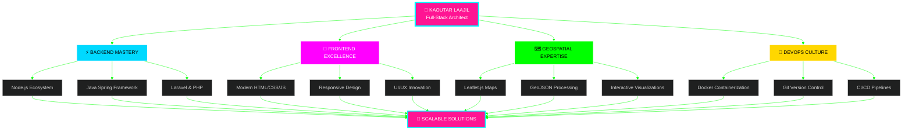
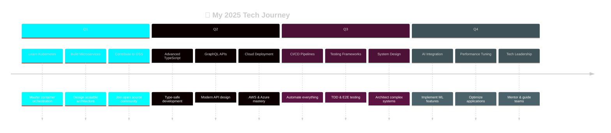

<!-- HERO SECTION avec animation de particules -->
<div align="center">

<!-- Animation de titre avec effet néon -->


<!-- Banner animé avec effet wave -->


<!-- Badges animés -->
<p>
  
  
  
</p>

<!-- GIF de séparation -->


</div>

---

<!-- SECTION À PROPOS avec design futuriste -->
<div align="center">

## 『 ✨ WHO AM I ✨ 』


</div>

```yaml
name: Kaoutar Laajil
role: Full-Stack Developer & Solution Architect
location: 🌍 Casablanca, Morocco
specialization: [Web Development, Interactive Maps, API Design]
passion: Building scalable solutions that make a difference
status: Open to exciting opportunities and collaborations

philosophy: |
  "Code is poetry. Every line tells a story, 
   every function solves a puzzle,
   and every project is a masterpiece waiting to be created."
```

<div align="center">

<!-- Ligne de séparation animée -->


</div>

---

<!-- TECH STACK avec design Matrix -->
<div align="center">

## 『 💻 TECH ARSENAL 💻 』


### ⚡ Backend Powerhouse

```ascii
╔════════════════════════════════════════════════════════════════════════╗
║                                                                        ║
║   🟢 Node.js + Express    ████████████████████░░  95%  🚀 Expert     ║
║   ☕ Java + Spring Boot   ████████████████░░░░░░  88%  💎 Advanced   ║
║   🎼 Laravel (PHP)        ████████████████░░░░░░  82%  ⚡ Proficient ║
║   🗄️  MySQL + PostgreSQL  █████████████████░░░░░  87%  🔥 Skilled    ║
║   🔐 JWT & OAuth 2.0      ████████████████████░░  90%  🛡️  Expert     ║
║   🔌 RESTful APIs         ████████████████████░░  93%  ✨ Master     ║
║                                                                        ║
╚════════════════════════════════════════════════════════════════════════╝
```

<p align="center">
  
</p>

### 🎨 Frontend Artistry

```ascii
╔════════════════════════════════════════════════════════════════════════╗
║                                                                        ║
║   🎯 HTML5 & CSS3         ████████████████████░░  95%  🎨 Expert     ║
║   ⚡ JavaScript (ES6+)    ████████████████████░░  90%  💫 Advanced   ║
║   🌊 Tailwind CSS         █████████████████░░░░░  88%  🎭 Skilled    ║
║   🅱️  Bootstrap 5          █████████████████░░░░░  85%  ⚙️  Proficient║
║   📜 EJS Templates        ███████████████░░░░░░░  75%  📝 Competent  ║
║   🗺️  Leaflet.js           █████████████████░░░░░  87%  🌍 Expert    ║
║   🎬 GSAP Animations      ██████████████░░░░░░░░  70%  ✨ Learning   ║
║                                                                        ║
╚════════════════════════════════════════════════════════════════════════╝
```

<p align="center">
  
</p>

### 🛠️ DevOps & Tools

```ascii
╔════════════════════════════════════════════════════════════════════════╗
║                                                                        ║
║   🐳 Docker               ████████████████████░░  90%  📦 Expert     ║
║   📦 Git & GitHub         ████████████████████░░  95%  🔱 Master     ║
║   📮 Postman & Insomnia   █████████████████░░░░░  88%  🧪 Advanced   ║
║   💻 VS Code              ████████████████████░░  95%  ⌨️  Expert     ║
║   🧠 IntelliJ IDEA        █████████████████░░░░░  85%  🎯 Skilled    ║
║   🐧 Linux (Ubuntu)       ████████████████░░░░░░  82%  🐧 Proficient ║
║                                                                        ║
╚════════════════════════════════════════════════════════════════════════╝
```

<p align="center">
  
</p>

</div>

---

<!-- ARCHITECTURE DIAGRAM -->
<div align="center">

## 『 🏗️ ARCHITECTURE VISION 🏗️ 』



</div>

---

<!-- GITHUB STATS avec design premium -->
<div align="center">

## 『 📊 GITHUB ANALYTICS 📊 』


<!-- Stats principaux avec effet néon -->
 


<!-- Streak stats avec design moderne -->


<!-- Contribution graph avec couleurs personnalisées -->


<!-- Trophées avec animation -->


</div>

---

<!-- PROJETS HIGHLIGHT avec cards animées -->
<div align="center">

## 『 🌟 FEATURED PROJECTS 🌟 』


</div>

<table align="center">
<tr>
<td width="50%" valign="top">

### 🗺️ Interactive Mapping Platform
**Tech Stack:** Node.js, Express, Leaflet.js, PostgreSQL

Real-time geospatial data visualization with advanced mapping features
- 📍 Custom markers & layers
- 🎯 Location-based search
- 📊 Data analytics dashboard
- 🔄 Live updates

[](https://github.com/kooutar)

</td>
<td width="50%" valign="top">

### 🏢 Enterprise Management System
**Tech Stack:** Spring Boot, React, MySQL, Docker

Complete business solution with microservices architecture
- 👥 User & role management
- 📈 Advanced reporting
- 🔐 Secure authentication
- 🌐 RESTful APIs

[](https://github.com/kooutar)

</td>
</tr>
<tr>
<td width="50%" valign="top">

### 📱 Modern E-Commerce Platform
**Tech Stack:** Laravel, Tailwind CSS, Stripe API

Full-featured online store with payment integration
- 🛒 Shopping cart system
- 💳 Secure payments
- 📦 Order tracking
- ⭐ Product reviews

[](https://github.com/kooutar)

</td>
<td width="50%" valign="top">

### 🎯 Task Management Dashboard
**Tech Stack:** Node.js, EJS, MongoDB, Socket.io

Collaborative project management with real-time updates
- ✅ Kanban boards
- 👥 Team collaboration
- 📅 Calendar integration
- 🔔 Push notifications

[](https://github.com/kooutar)

</td>
</tr>
</table>

---

<!-- ROADMAP 2025 avec timeline -->
<div align="center">

## 『 🎯 2025 ROADMAP 🎯 』


</div>



<table align="center">
<tr>
<th>🎯 Objectif</th>
<th>📊 Progrès</th>
<th>🎖️ Priorité</th>
<th>📅 Timeline</th>
</tr>
<tr>
<td>☸️ Maîtriser Kubernetes</td>
<td></td>
<td>🔴 HAUTE</td>
<td>Q1-Q2 2025</td>
</tr>
<tr>
<td>🔄 Implémenter CI/CD</td>
<td></td>
<td>🔴 HAUTE</td>
<td>Q1 2025</td>
</tr>
<tr>
<td>🏗️ Architecture Microservices</td>
<td></td>
<td>🟡 MOYENNE</td>
<td>Q2 2025</td>
</tr>
<tr>
<td>🤖 Explorer AI & Machine Learning</td>
<td></td>
<td>🟢 NORMALE</td>
<td>Q3-Q4 2025</td>
</tr>
<tr>
<td>🌟 Contributions Open Source</td>
<td></td>
<td>🟡 MOYENNE</td>
<td>Continu</td>
</tr>
<tr>
<td>🎨 Design Systems & UI/UX</td>
<td></td>
<td>🟡 MOYENNE</td>
<td>Q2 2025</td>
</tr>
</table>

---

<!-- CODE TIME STATS -->
<div align="center">

## 『 ⏱️ CODING ACTIVITY ⏱️ 』

```ascii
╔══════════════════════════════════════════════════════════════════════╗
║                     📊 Weekly Development Stats 📊                   ║
╠══════════════════════════════════════════════════════════════════════╣
║                                                                      ║
║  📅 Monday      ████████████████░░░░░░░░  6h 30m   🔥              ║
║  📅 Tuesday     ███████████████████████░  8h 45m   🔥🔥            ║
║  📅 Wednesday   ████████████████████░░░░  7h 15m   🔥              ║
║  📅 Thursday    ████████████████████████  9h 00m   🔥🔥🔥          ║
║  📅 Friday      ██████████████████░░░░░░  6h 45m   🔥              ║
║  📅 Saturday    ████████████░░░░░░░░░░░░  4h 20m   💎              ║
║  📅 Sunday      ███████████░░░░░░░░░░░░░  3h 30m   ✨              ║
║                                                                      ║
║  📈 Total This Week: 46h 05m                                        ║
║  🏆 Most Productive Day: Thursday (9h 00m)                          ║
║  💻 Languages: JavaScript, Java, PHP, SQL                           ║
║                                                                      ║
╚══════════════════════════════════════════════════════════════════════╝
```

</div>

---

<!-- CONTACT SECTION avec design moderne -->
<div align="center">

## 『 📬 LET'S CONNECT 📬 』


### 💫 Reach Out & Build Something Amazing Together

<p align="center">
  <a href="mailto:kawtarlaajil7@gmail.com">
    
  </a>
  <a href="https://www.linkedin.com/in/kaoutar-laajil-8b2473224/">
    
  </a>
  <a href="https://github.com/kooutar">
    
  </a>
  <a href="https://twitter.com/kooutar">
    
  </a>
  <a href="https://www.instagram.com/kooutar/">
    
  </a>
</p>

<!-- Animated typing text -->


</div>

---

<!-- QUOTE SECTION avec design inspirant -->
<div align="center">

## 『 💭 PHILOSOPHY 💭 』

```ascii
╔════════════════════════════════════════════════════════════════════╗
║                                                                    ║
║  "The only way to do great work is to love what you do.          ║
║   If you haven't found it yet, keep looking.                     ║
║   Don't settle."                                                  ║
║                                                                    ║
║                                          - Steve Jobs             ║
║                                                                    ║
╚════════════════════════════════════════════════════════════════════╝
```


</div>

---

<!-- VISITOR COUNTER avec animation -->
<div align="center">

### 👁️ Profile Views


<!-- Snake animation -->
<picture>
  <source media="(prefers-color-scheme: dark)" srcset="https://raw.githubusercontent.com/kooutar/kooutar/output/github-contribution-grid-snake-dark.svg">
  <source media="(prefers-color-scheme: light)" srcset="https://raw.githubusercontent.com/kooutar/kooutar/output/github-contribution-grid-snake.svg">
  
</picture>

</div>

---

<!-- FOOTER avec wave animation -->
<div align="center">


<!-- Final animated message -->


<br><br>

**⚡ Crafted with 💙 by Kaoutar Laajil | © 2025 | Made with passion & coffee ☕**


</div>
