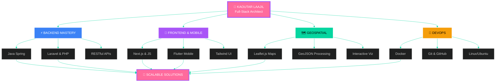

<!-- HERO SECTION -->
<div align="center">


<p>
  
  
  
</p>


</div>

---

<!-- WHO AM I -->
<div align="center">

## ✨ Who Am I ✨


</div>

```yaml
name       : Kaoutar Laajil
role       : Full-Stack Developer & Solution Architect
location   : 🌍 Casablanca, Morocco
specialties: [Web Development, Mobile Apps, Interactive Maps, API Design]
passion    : Building scalable solutions that make a real difference
status     : Open to exciting opportunities & collaborations

philosophy : |
  "Code is poetry. Every line tells a story,
   every function solves a puzzle,
   and every project is a masterpiece waiting to be created."
```

<div align="center">

</div>

---

<!-- TECH STACK -->
<div align="center">

## 💻 Tech Arsenal 💻


### ⚡ Backend Powerhouse

```
╔════════════════════════════════════════════════════════════════════════╗
║                                                                        ║
║   ☕ Java + Spring Boot   ████████████████░░░░░░  88%  💎 Advanced   ║
║   🎼 Laravel (PHP)        ████████████████░░░░░░  82%  ⚡ Proficient ║
║   🗄️  MySQL + PostgreSQL  █████████████████░░░░░  87%  🔥 Skilled    ║
║   🔐 JWT & OAuth 2.0      ████████████████████░░  90%  🛡️  Expert     ║
║   🔌 RESTful APIs         ████████████████████░░  93%  ✨ Master     ║
║                                                                        ║
╚════════════════════════════════════════════════════════════════════════╝
```

<p align="center">
  
</p>

### 🎨 Frontend & Mobile

```
╔════════════════════════════════════════════════════════════════════════╗
║                                                                        ║
║   🎯 HTML5 & CSS3         ████████████████████░░  95%  🎨 Expert     ║
║   ⚡ JavaScript (ES6+)    ████████████████████░░  90%  💫 Advanced   ║
║   ▲  Next.js              ████████████████░░░░░░  80%  🚀 Growing    ║
║   🌊 Tailwind CSS         █████████████████░░░░░  88%  🎭 Skilled    ║
║   🅱️  Bootstrap 5          █████████████████░░░░░  85%  ⚙️  Proficient║
║   💙 Flutter              ███████████████░░░░░░░  75%  📱 Building   ║
║   🗺️  Leaflet.js           █████████████████░░░░░  87%  🌍 Expert    ║
║   🎬 GSAP Animations      ██████████████░░░░░░░░  70%  ✨ Learning   ║
║                                                                        ║
╚════════════════════════════════════════════════════════════════════════╝
```

<p align="center">
  
</p>

### 🛠️ DevOps & Tools

```
╔════════════════════════════════════════════════════════════════════════╗
║                                                                        ║
║   🐳 Docker               ████████████████████░░  90%  📦 Expert     ║
║   📦 Git & GitHub         ████████████████████░░  95%  🔱 Master     ║
║   📮 Postman & Insomnia   █████████████████░░░░░  88%  🧪 Advanced   ║
║   💻 VS Code              ████████████████████░░  95%  ⌨️  Expert     ║
║   🧠 IntelliJ IDEA        █████████████████░░░░░  85%  🎯 Skilled    ║
║   🐧 Linux (Ubuntu)       ████████████████░░░░░░  82%  🐧 Proficient ║
║                                                                        ║
╚════════════════════════════════════════════════════════════════════════╝
```

<p align="center">
  
</p>

</div>

---

<!-- ARCHITECTURE -->
<div align="center">

## 🏗️ Architecture Vision 🏗️


```mermaid
%%{init: {'theme':'dark', 'themeVariables': { 'primaryColor': '#FF6B9D', 'primaryTextColor': '#fff', 'primaryBorderColor': '#A855F7', 'lineColor': '#06D6A0', 'secondaryColor': '#F59E0B', 'tertiaryColor': '#3B82F6'}}}%%
graph TB
    A[🎯 KAOUTAR LAAJIL<br/>Full-Stack Architect]

    A --> B[⚡ BACKEND MASTERY]
    A --> C[🎨 FRONTEND & MOBILE]
    A --> D[🗺️ GEOSPATIAL]
    A --> E[🔧 DEVOPS]

    B --> B1[Java Spring]
    B --> B2[Laravel & PHP]
    B --> B3[RESTful APIs]

    C --> C1[Next.js & JS]
    C --> C2[Flutter Mobile]
    C --> C3[Tailwind UI]

    D --> D1[Leaflet.js Maps]
    D --> D2[GeoJSON Processing]
    D --> D3[Interactive Viz]

    E --> E1[Docker]
    E --> E2[Git & GitHub]
    E --> E3[Linux/Ubuntu]

    B1 --> F[🚀 SCALABLE SOLUTIONS]
    B2 --> F
    C1 --> F
    C2 --> F
    D1 --> F
    E1 --> F

    style A fill:#FF6B9D,stroke:#A855F7,stroke-width:4px,color:#fff
    style B fill:#3B82F6,stroke:#fff,stroke-width:2px,color:#fff
    style C fill:#A855F7,stroke:#fff,stroke-width:2px,color:#fff
    style D fill:#06D6A0,stroke:#fff,stroke-width:2px,color:#000
    style E fill:#F59E0B,stroke:#fff,stroke-width:2px,color:#000
    style F fill:#FF6B9D,stroke:#A855F7,stroke-width:3px,color:#fff
```

</div>

---

<!-- GITHUB STATS -->
<div align="center">

## 📊 GitHub Analytics 📊


</div>

---

<!-- FEATURED PROJECTS -->
<div align="center">

## 🌟 Featured Projects 🌟


</div>

<table align="center">
<tr>
<td width="50%" valign="top">

### 🗺️ Interactive Mapping Platform
**Tech Stack:** Java Spring, Leaflet.js, PostgreSQL

Real-time geospatial data visualization with advanced features
- 📍 Custom markers & layers
- 🎯 Location-based search
- 📊 Data analytics dashboard
- 🔄 Live updates

[](https://github.com/kooutar)

</td>
<td width="50%" valign="top">

### 📱 Flutter Mobile App
**Tech Stack:** Flutter, Dart, Firebase

Cross-platform mobile experience with beautiful UI
- 🎨 Custom animations
- 🔔 Push notifications
- 🔐 Secure auth
- 🌐 REST API integration

[](https://github.com/kooutar)

</td>
</tr>
<tr>
<td width="50%" valign="top">

### ▲ Next.js Web Platform
**Tech Stack:** Next.js, Tailwind CSS, PostgreSQL

Modern full-stack web application with SSR
- ⚡ Server-side rendering
- 🎨 Responsive design
- 🔌 API routes
- 📦 Optimized performance

[](https://github.com/kooutar)

</td>
<td width="50%" valign="top">

### 🛒 E-Commerce Platform
**Tech Stack:** Laravel, Tailwind CSS, Stripe API

Full-featured online store with payment integration
- 🛒 Shopping cart system
- 💳 Secure payments
- 📦 Order tracking
- ⭐ Product reviews

[](https://github.com/kooutar)

</td>
</tr>
</table>

---

<!-- CONNECT -->
<div align="center">

## 📬 Let's Connect 📬


### 💫 Reach Out & Build Something Amazing Together

<p align="center">
  <a href="mailto:kawtarlaajil7@gmail.com">
    
  </a>
  <a href="https://www.linkedin.com/in/kaoutar-laajil-8b2473224/">
    
  </a>
  <a href="https://github.com/kooutar">
    
  </a>
  <a href="https://twitter.com/kooutar">
    
  </a>
  <a href="https://www.instagram.com/kooutar/">
    
  </a>
</p>


</div>

---

<!-- PHILOSOPHY -->
<div align="center">

## 💭 Philosophy 💭

```
╔════════════════════════════════════════════════════════════════════╗
║                                                                    ║
║  "The only way to do great work is to love what you do.          ║
║   If you haven't found it yet, keep looking.                     ║
║   Don't settle."                                                  ║
║                                         — Steve Jobs             ║
║                                                                    ║
╚════════════════════════════════════════════════════════════════════╝
```


</div>

---

<!-- FOOTER -->
<div align="center">

### 👁️ Profile Views


<picture>
  <source media="(prefers-color-scheme: dark)" srcset="https://raw.githubusercontent.com/kooutar/kooutar/output/github-contribution-grid-snake-dark.svg">
  <source media="(prefers-color-scheme: light)" srcset="https://raw.githubusercontent.com/kooutar/kooutar/output/github-contribution-grid-snake.svg">
  
</picture>


<br><br>

**⚡ Crafted with 💙 by Kaoutar Laajil | © 2025 | Made with passion & coffee ☕**


</div>
